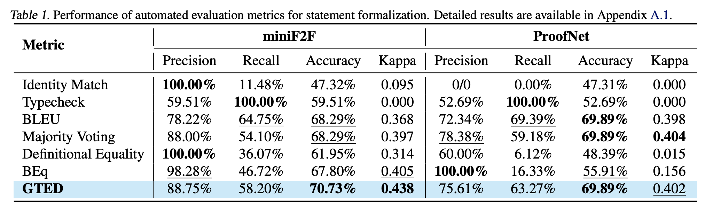

# [AI4Math@ICML 2025] GTED

📝Official implementation for the paper:

[Generalized Tree Edit Distance (GTED): A Faithful Evaluation Metric for Statement Autoformalization](https://arxiv.org/abs/2507.07399)


## 1. Introduction
Statement autoformalization, the automated translation of statements from natural language into formal languages, has become a subject of extensive research, yet the development of robust automated evaluation metrics remains limited. Existing evaluation methods often lack semantic understanding, face challenges with high computational costs, and are constrained by the current progress of automated theorem proving. To address these issues, we propose GTED (Generalized Tree Edit Distance), a novel evaluation framework that first standardizes formal statements and converts them into operator trees, then determines the semantic similarity using the eponymous GTED metric. Across the miniF2F and ProofNet benchmarks, GTED consistently ranks as a top-performing metric, achieving the highest accuracy and Kappa on miniF2F and the joint-highest accuracy on ProofNet. This strong overall performance provides the community with a computationally lightweight and more faithful metric for automated evaluation.


## 2. Evaluation Results
The table shows how our GTED metric performs compared to other baselines on miniF2F and ProofNet.




## 3. Quick Start
1. **Install Lean4**
    Follow the instructions on the [Lean4 installation page](https://leanprover-community.github.io/get_started.html) to set up Lean4.

2. **Clone the repository**
    ```sh
    git clone https://github.com/XiaoyangLiu-sjtu/GTED.git
    cd GTED
    ```

3. **Build REPL**
    Follow the instructions on the [Lean REPL page](https://github.com/leanprover-community/repl.git) to set up Lean REPL and change the `DEFAULT_LEAN_WORKSPACE` & `MATHLIB_PATH` parameters in `src/verifier.py` & `utils.py` to your REPL & Mathlib paths.

4. **Evaluation**
    There are three functions `tree_lean_codes`, `ted_lean_codes` and `evaluation_benchmark` in `main.py` for evaluation.

    - `tree_lean_codes`: Input header and formal statement to build the corresponding operator tree.
        ```shell
        # Function1: tree_lean_codes
        start_time = time.time()
        header_list = ["import Mathlib\n"] * 100
        formal_statement_list = ["theorem th_name (p : Prop) : let q := ¬¬p; p = q := by sorry"] * 100
        tree_lean_codes(header_list, formal_statement_list)
        end_time = time.time()
        print(f"Time taken for one lean code: {end_time - start_time:.2f} seconds")
        ```
    
    - `ted_lean_codes`: Input a pair of header and formal statements, build the corresponding operator tree and calculate the TED similarity.
        ```shell
        # Function2: ted_lean_codes
        label_header_list = ["import Mathlib"] * 3
        label_formal_statement_list = ["theorem th_name (p : Prop) : let q := ¬¬p; p = q := by sorry"] * 3
        predict_header_list = ["import Mathlib"] * 3
        predict_formal_statement_list = ["theorem th_name (p : Prop) : let q := ¬¬p; p = q := by sorry"] * 3
        print(ted_lean_codes(label_header_list, label_formal_statement_list, predict_header_list, predict_formal_statement_list))
        ```

    - `evaluation_benchmark`: Just pass in miniF2F or ProofNet. Please note that you may need to change the format of your own json file. This function is currently adapted to the json file format in `experiment/{benchmark}/human_evaluation.json`.
        ```shell
        # Function3: evaluation_benchmark
        evaluation_benchmark("minif2f")
        evaluation_benchmark("proofnet")
        ```


## 4. Citation
```bibtex
@inproceedings{liu2025generalized,
  title={Generalized Tree Edit Distance (GTED): A Faithful Evaluation Metric for Statement Autoformalization},
  author={Liu, Yuntian and Zhu, Tao and Liu, Xiaoyang and Chen, Yu and ZhaoXuan, Liu and Zhang, Jiashuo and Bao, Kangjie and Luo, Tao and others},
  booktitle={2nd AI for Math Workshop @ ICML 2025},
  year={2025}
}
```


## 5. Contact
Feel free to discuss the paper/data/code with us through issues/emails!
- Xiaoyang Liu: xiaoyang.liu@sjtu.edu.cn